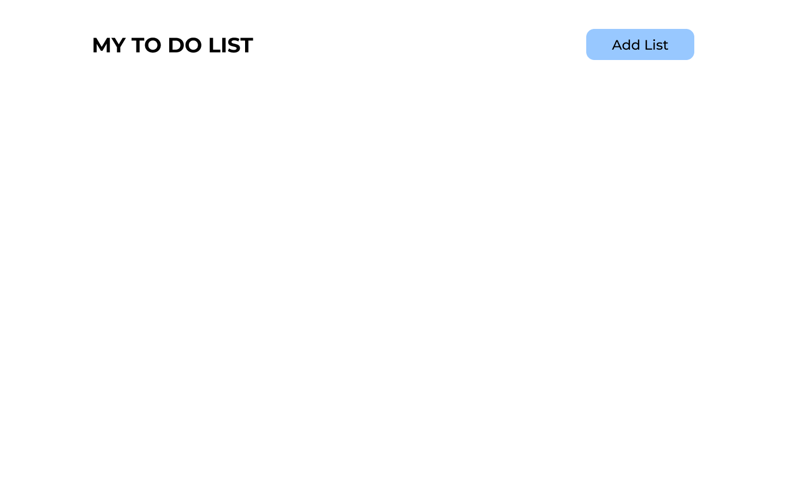
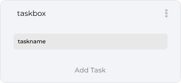

# TO DO LIST

## Main Idea & Features

- Basic CRUD for Task
- Basic CRUD for Task Container
- Being able to change in wich container the task is 

## Design Idea

- Black and white theme
- 3 Containers per row on desktop
- 1 Container per row on mobile & other small device

### Final Result



With Containers 


With one task in the first taskbox of the first row



### Additional Features to add afterward

- Being able to select multiple task to delete in a container
- Same but being able to drag them into another container

## Actual Concerns

Having a very hard time figuring out how to structure my html for the CRUD features to work properly.
But as of now this is what I came up with.

```html
        <div class="row-container">

            <div class="row-1">
                <div class="task-box-1">
                    <p class="task-box-name">taskname</p>

                    <div class="task">
                        <p class="task-name"></p>
                    </div>

                    <button class="AddCard"></button>
                </div>
                <div class="task-box-2">
                    <p class="taskname">taskname</p>

                </div>
                <div class="task-box-3">
                    <p class="taskname">taskname</p>

                </div>
            </div>

        </div>
```